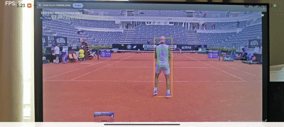
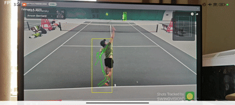
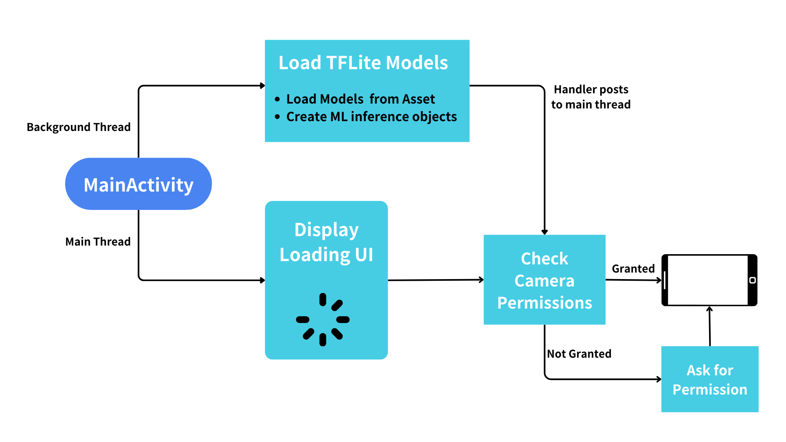
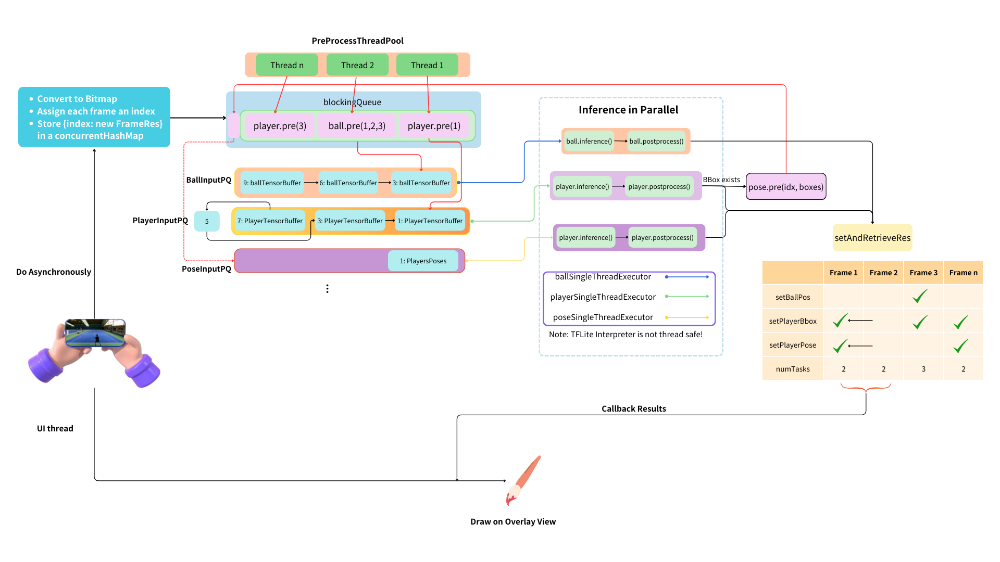

# ActiveVision Tennis Analysis Andriod Application

This App integrates multiple computer vision models to track the tennis ball trajectory and player movements in real-time using just your Android device. Whether analyzing player's performance or enjoying the tennis match, gain instant, accurate insights to enhance the tennis experience.

  
  

You can view a 3 min demo video on [YouTube](https://youtu.be/aY2wUt3JSgw), [bilibili](https://www.bilibili.com/video/BV1VMNNerEby/)

## Program Design

## How to Add More Models

1. Clone this repository to your local machine.
2. Copy the `.tflite` file to `src/main/assets/<your_model>.tflite`
3. In [gradle.properties](https://gitee.com/michaellzy/active-vision-app/blob/main/gradle.properties), add a namespace to the name of your model file (`<your_model>.tflite`).
4. In `build.gradle`, include your model name in `resValue(...)`.
5. run gradle sync, and build the project.

## Targeted Devices

This app supports the following hardware:

- [Qualcomm Hexagon NPU](https://developer.qualcomm.com/software/qualcomm-ai-engine-direct-sdk)
- [GPU -- via GPUv2](https://github.com/tensorflow/tensorflow/tree/master/tensorflow/lite/delegates/gpu)
- [CPU -- via XNNPack](https://github.com/tensorflow/tensorflow/blob/master/tensorflow/lite/delegates/xnnpack/README.md)

For current implementation, the App expects to run on Qualcomm Snapdragon with Hexagon NPU and should above Snapdragon 8+ Gen 1.

## Tested Devices

| Device Name   | Processor           | Model Delegates | Performance |
| ------------- | ------------------- | --------------- | ----------- |
| Redmi Turbo 3 | Snapdragon 8s Gen 3 | NPU             | 30 FPS      |
|               |                     |                 |             |

## Model Progress

| Task            | Used Algorithm | Code                                                                                | Note                                                   | Progress |
| --------------- | -------------- |-------------------------------------------------------------------------------------|--------------------------------------------------------|---------|
| Tennis Tracking | TrackNetV2     | [Link](https://gitee.com/michaellzy/activevison-tracknet/tree/main/TrackNet-Modify) | Tends to detect any round objects as tennis ball       | :hourglass_flowing_sand: |
| Player Tracking | YOLOv8-nano | [Link](https://anu365-my.sharepoint.com/:u:/g/personal/u7690985_anu_edu_au/EZ_YinrGWv5PilzwJFn1kxMBbA64nPCnb3kiCq0eEwf3Kg?e=KV2hUW)                                                                            | Should also add tracking algorithm (ByteTrack/BoT-SORT) | :hourglass_flowing_sand: |
| Pose Estimation | MobileNetV2 | [Link](https://gitee.com/michaellzy/pose-estimation-tflite)                         | LiteHRNet: Works for fp16 model, but uint8 model's accuracy drops significantly | :hourglass_flowing_sand: |

## Reference

- [TrackNet implementation](https://github.com/Chang-Chia-Chi/TrackNet-Badminton-Tracking-tensorflow2), [original paper](https://ieeexplore.ieee.org/document/9302757)
- [YOLOv8](https://docs.ultralytics.com/models/yolov8/)
- [Qualcomm Sample Apps](https://github.com/quic/ai-hub-apps/tree/main/apps/android)

