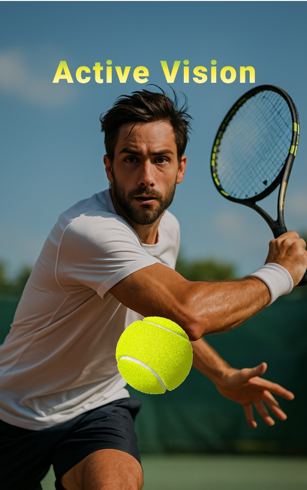
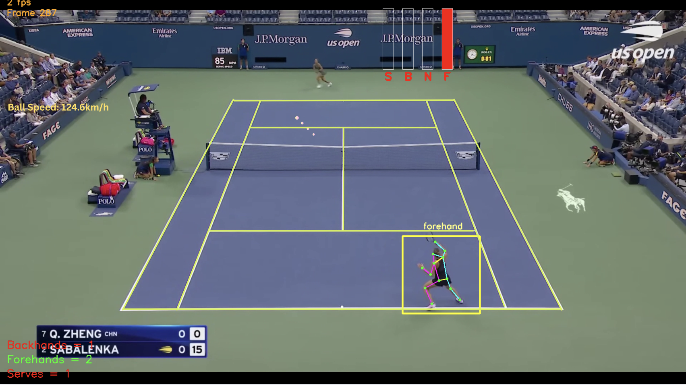

###  System Requirements

- Android 10 or higher
- Rear camera enabled
- Recommended: ≥ 4 GB RAM and mid-tier GPU

### Getting Started

Step 1: Launch the App
- Tap the Active Vision icon from your home screen

Step 2: Click the tennis ball button to start camera

Step 3: Enable camera permission

Step 4: Start Detection

- Point the camera at the tennis court
- Ensure lighting is sufficient
- The analysis automatically starts

### Interpreting Results
- Human skeleton and bounding box overlay = detected player
- Court lines overlay = detected court
- Red dots = detected ball
- Top right SBNF bars = Serve Backhand Neutral Forehand detection probability
- Top left = tennis ball speed
- Bottom left corner = total number of serve, uses of backhand and forehand

If detection fails, reposition camera and ensure court is fully visible
