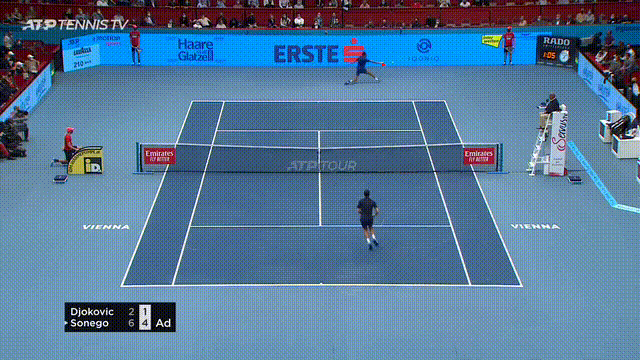

### TrackNetV2 Modification



#### Key Modifications

1. Combine ResNet and U-Net to form network architecture with MIMO(3 in 3 out) version.

2. Use focal loss instead of WBCE loss.

3. Use consecutive 3 grayscale images as input to the network to reduce pre-processing speed.

4. Use `AdamW` as the optimizer instead of `AdaDelta`.


#### Training Parameters

| Parameter           |                Value                 |
| ------------------- | :----------------------------------: |
| Input shape         |       N x 288 x 512 x 3 (NHWC)       |
| Output shape        | N x 288 x 512 x 3 (NHWC), 3 heatmaps |
| Heatmap ball radius |              2.5 pixels              |
| Optimizer           |  AdamW(lr=1e-3, weight decay=5e-4)   |
| Epochs              |                  50                  |
| Batch Size          |                  3                   |

#### Set Up

1. Download [tennis dataset](https://anu365-my.sharepoint.com/:f:/r/personal/u7690985_anu_edu_au/Documents/Active-Vision-Dataset/tennis-dataset?csf=1&web=1&e=qLzVhz)

2. Install the following packages

   ```tex
   tensorflow[and-cuda]==2.12.0
   pandas
   pillow
   scikit-learn
   matplotlib
   focal_loss==0.0.7
   opencv-python
   [optional] tflite-runtime
   ```

3. Generate pre-processing data and ground truth data as `npz` files:
    ```
    python3 gen_input_data.py --data_path=<Path to the dataset> --save_dir=<Path to save npz files>
    ```

4. Run the following command to start training:
    ```
    python3 train.py --save_weights=<Path to save the trained model> --dataDir=<Path to generated npz files> --epochs=50 --tol=4
    ```

5. To inference the trained model on a video:
    ```
    python3 test.py --video_name=<videoPath> --load_weights=<saved model path>
    ```

#### Convert to TFLITE Model

- Convert to FP16 model:
    ```
    python3 model_conversion_tflite.py --model_path=<path to saved model> --save_path=<path to save tflite model> --model_name=<tflite model name> --mode=fp16
    ```

- Convert to full integer (UINT8) model with post-training quantization:
    ```
    python3 model_conversion_tflite.py --model_path=<path to saved model> --data_dir=<path to npz files> --save_path=<path to save tflite model> --model_name=<tflite model name> --mode=uint8 --num_calibration_samples=<number of samples to calibrate. suggest to set 100-500>
    ```

#### Reference

- [TrackNet-Badminton-Tracking-tensorflow2](https://github.com/Chang-Chia-Chi/TrackNet-Badminton-Tracking-tensorflow2/tree/main)
Implemented ResNet+Unet architecture with 3-in-1-out, and proposed to use grayscale images as input and use Focal Loss

-  N. -E. Sun et al., "TrackNetV2: Efficient Shuttlecock Tracking Network," 2020 International Conference on Pervasive Artificial Intelligence (ICPAI), Taipei, Taiwan, 2020, pp. 86-91, doi: 10.1109/ICPAI51961.2020.00023.


- [Original implementation of TrackNetV2](https://gitlab.nol.cs.nycu.edu.tw/open-source/TrackNetv2)